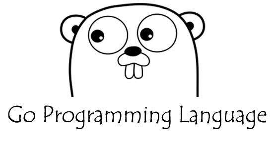

# OAuth2Go简介

Go语言实现的轻量级OAuth2服务器，为小伙伴入门Golang语言开发工具。同时考虑到OAuth2是微服务架构的重要环节，进行分析一个轻量级OAuth2服务器(项目名OAuth2Go)的设计和实现，让小伙伴深入理解OAuth2服务的原理和实现。 

* Spring Cloud OAuth2复杂难以理解
* OAuth2的四个流程到底是如何实现的
* 接合实际项目架构设计和实战开发



## Go安装
略

## 代码下载
```
go get github.com/huangbosbos/oauth2go
```